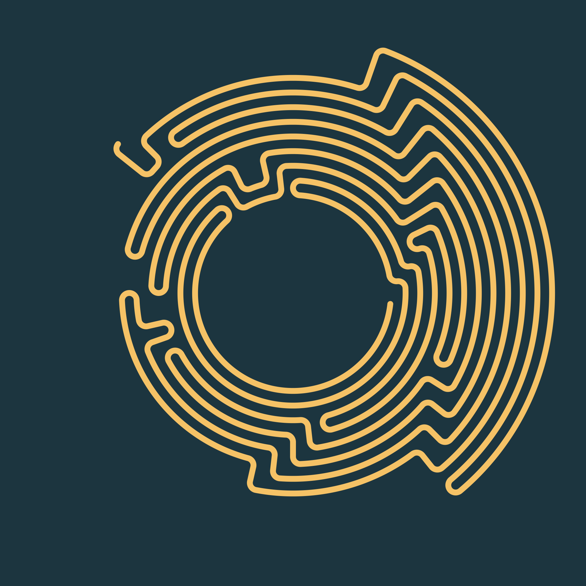

# SVG Composer
[](https://crates.io/crates/svg_composer)

A strongly typed [SVG](https://developer.mozilla.org/en-US/docs/Web/SVG) composing library written in [Rust](https://www.rust-lang.org/). This library allows you to ensure the soundness of your generated SVGs at the compile time of your project.

This project was made originaly for the generative art project : https://stegano.graphics 

Rendering example of stegano.graphics using this library:


## Disclaimer

This library is still in early development and some API changes are to be expected, mainly to further enforce typing. 

## Example

```rust
let svg_document = Document::new(
    vec![Box::new(
        Path::new()
            .set_stroke(Paint::from_color(Color::from_name(ColorName::Fuchsia)))
            .set_stroke_width(Size::from_length(10.0))
            .add_commands(vec![
                Box::new(MoveTo {
                    point: (11., 1.),
                    coordinate_type: CoordinateType::Absolute,
                }),
                Box::new(LineTo {
                    point: (10.0, 20.0),
                    option: LineToOption::Default,
                    coordinate_type: CoordinateType::Relative,
                }),
                Box::new(LineTo {
                    point: (-20.0, 0.0),
                    option: LineToOption::Default,
                    coordinate_type: CoordinateType::Relative,
                }),
                Box::new(End {}),
            ]),
    )],
    Some([0., 0., 100., 100.]),
);

// This rendering outputs a .svg file which can then be rendered as an image by an svg renderer
println!("{}", svg_document.render());
```